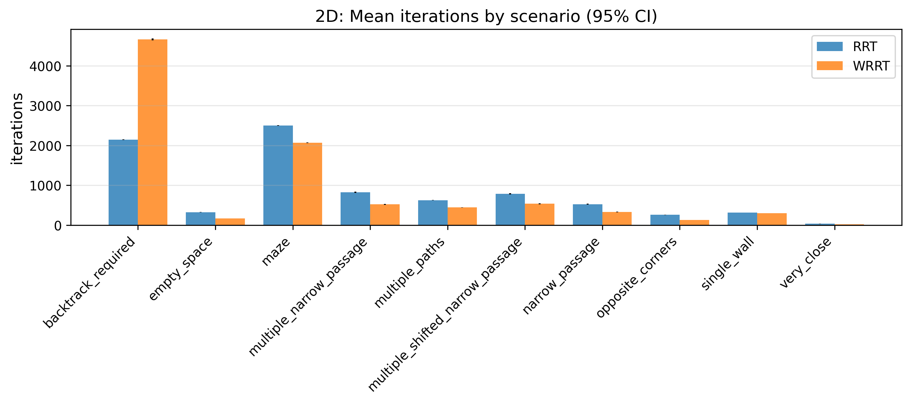
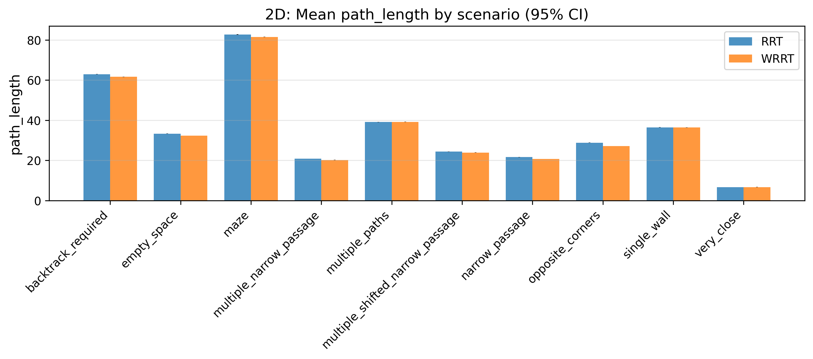
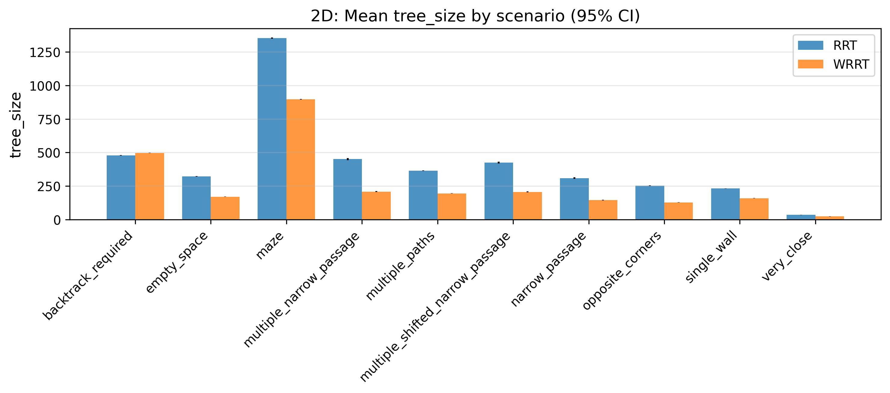
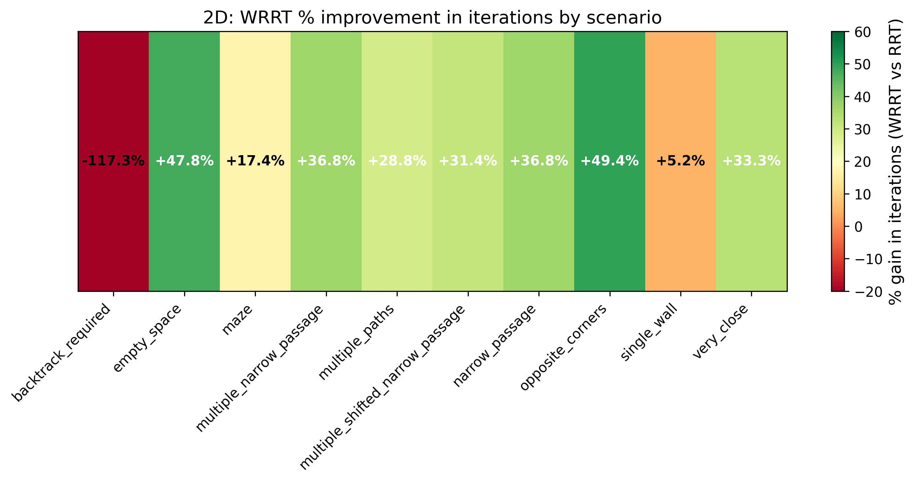
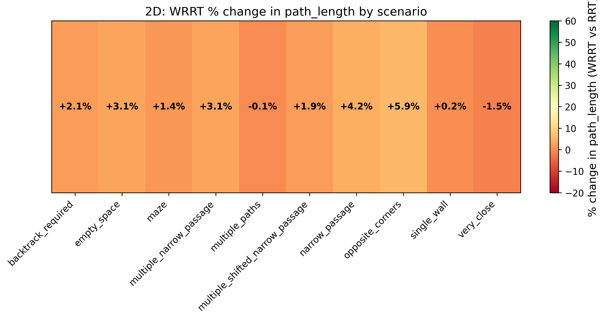
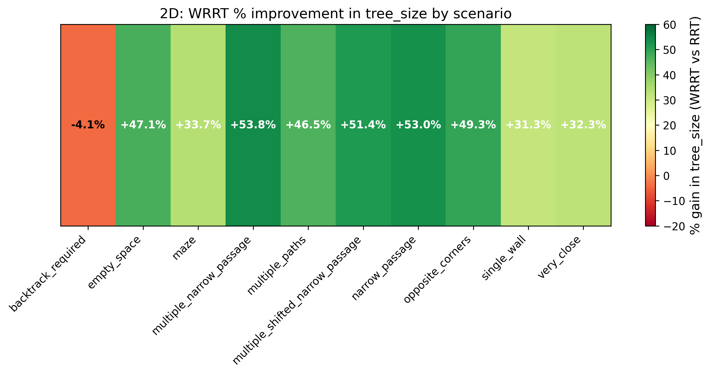

## 2D Processed Graphs

Below are the 2D result visualizations generated in `AnalysisV2/Graphics2d`.

> Source: `../AnalysisV2/Graphics2d/`

### Scenario bars

- Iterations

- Path length

- Tree size

### Improvement heatmaps

- Iterations improvement

- Path length improvement

- Tree size improvement

