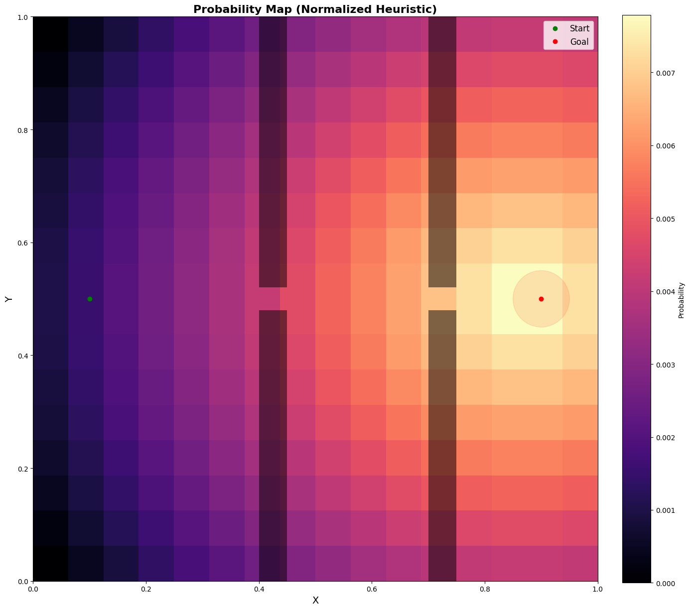
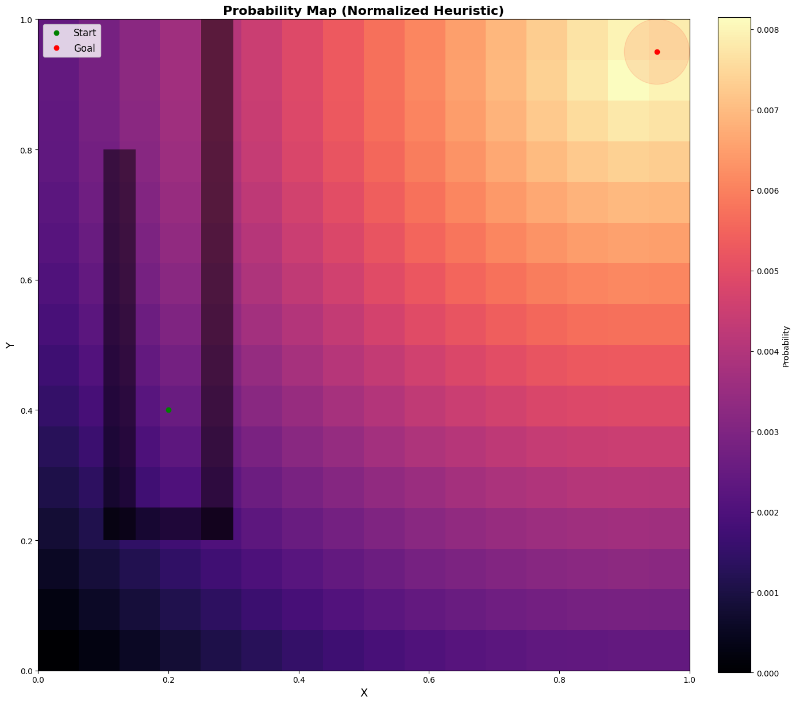
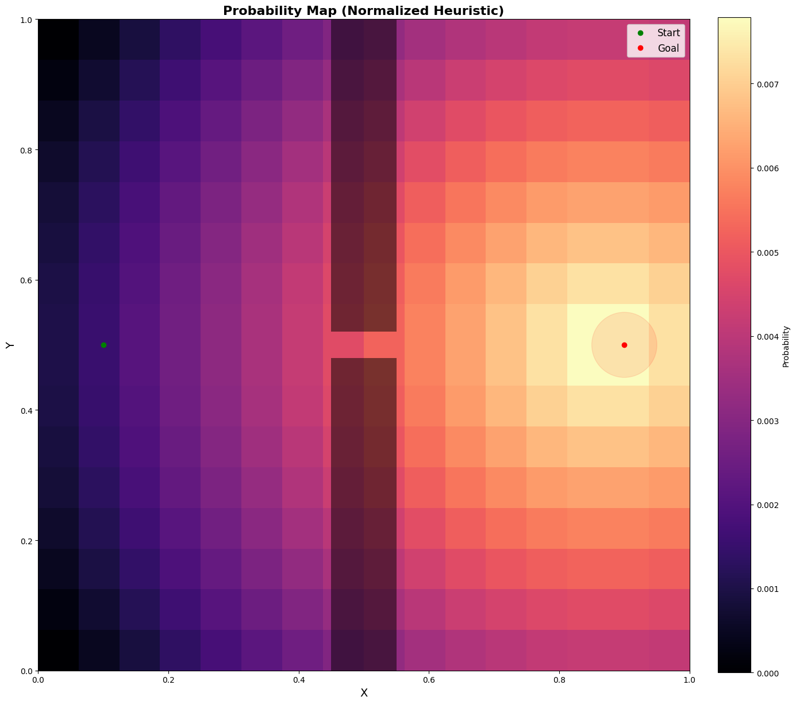
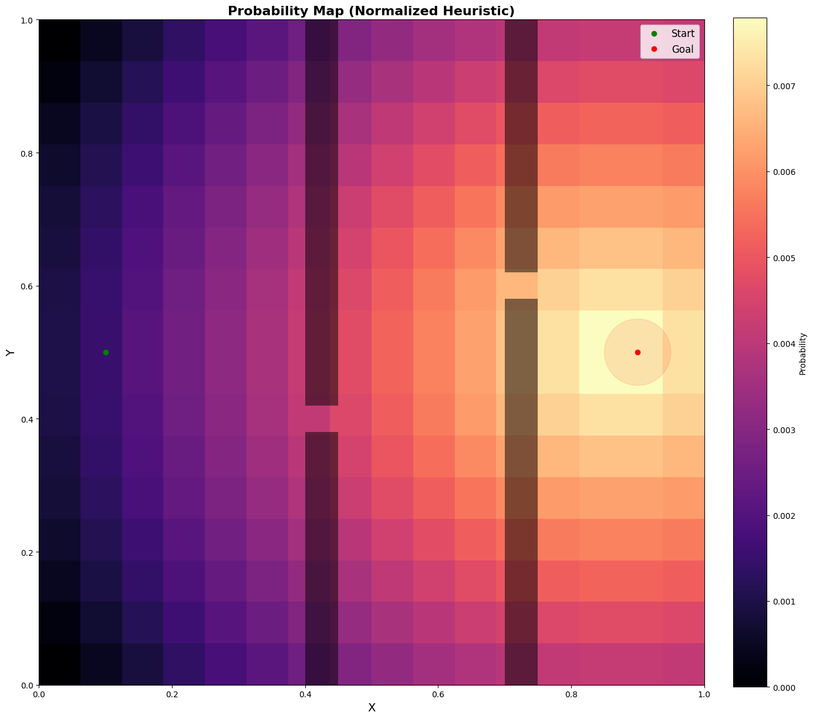
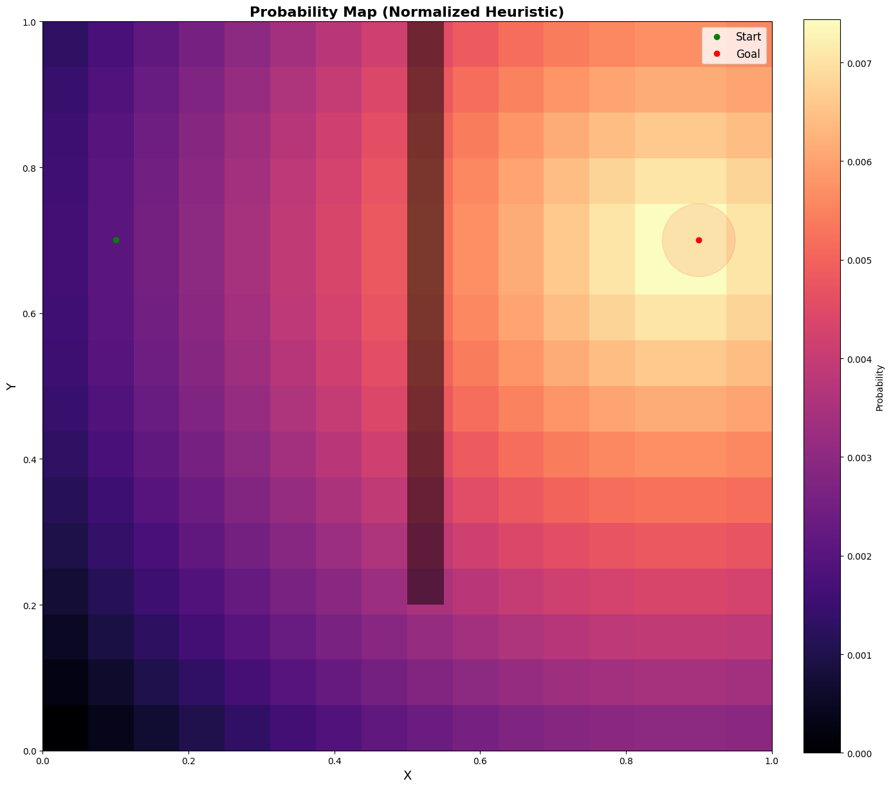
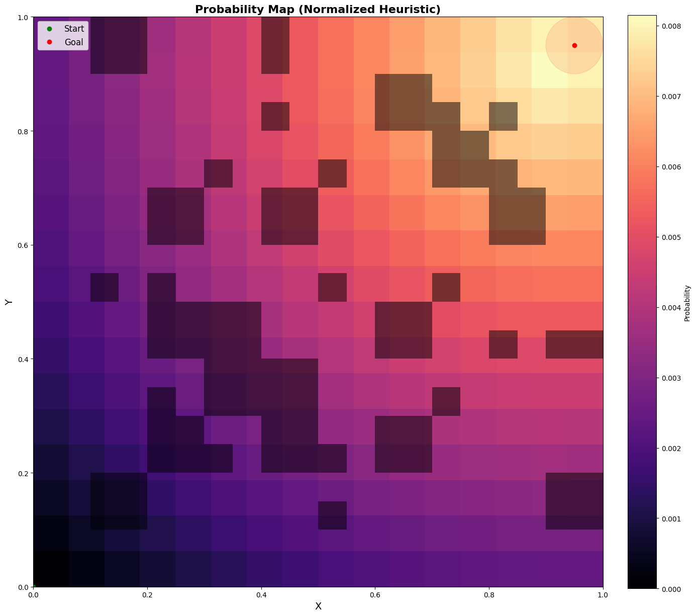
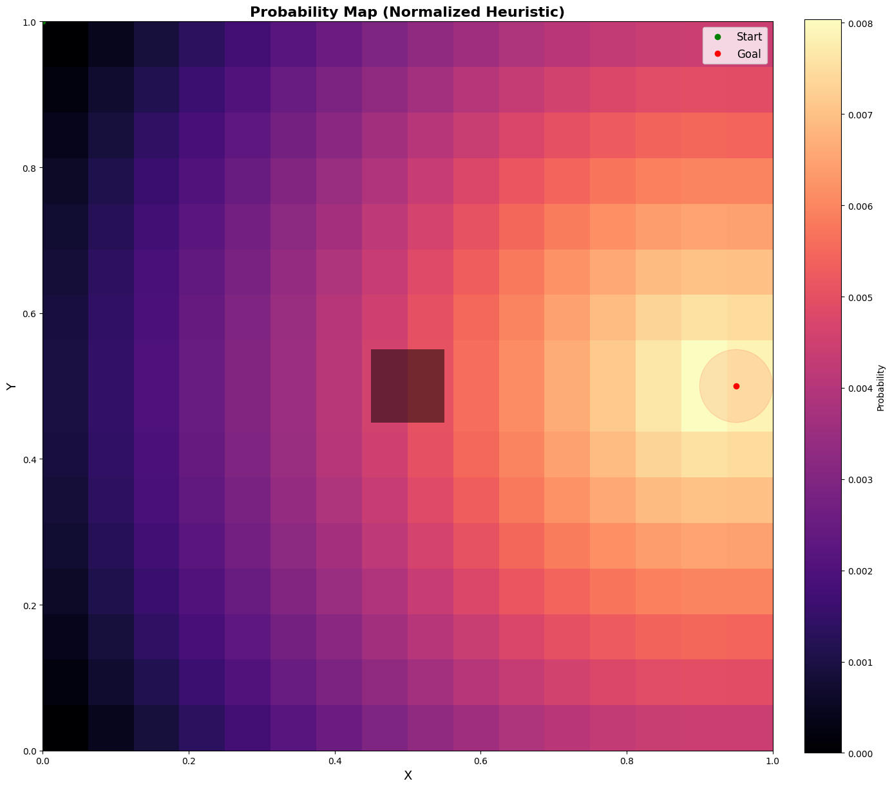
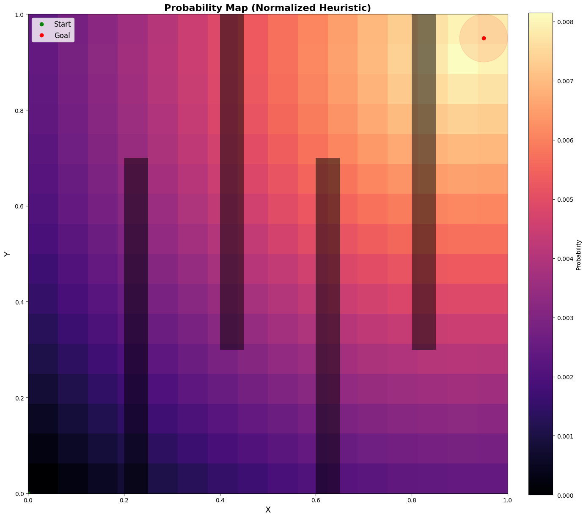
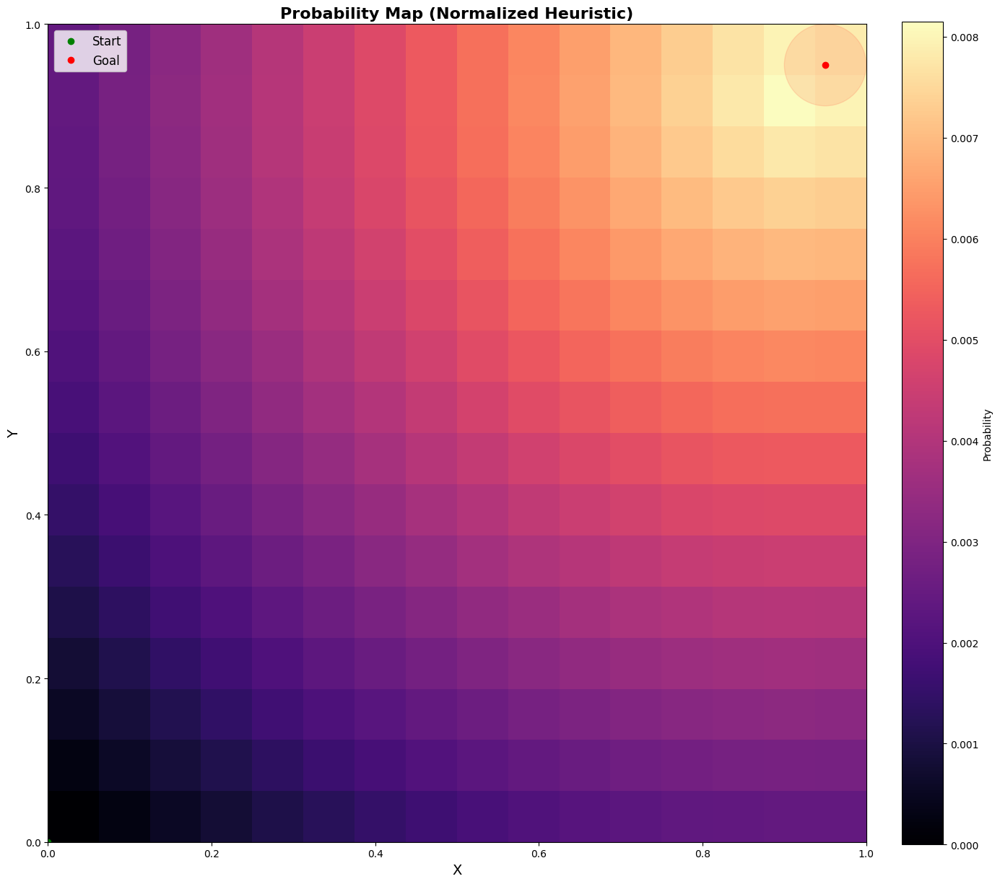

## Heuristic Grid

Heuristic overlays for 2D and 3D scenarios.

### 2D heuristic weights (Graphics2d/Weights2d)

Below are weight visualizations sourced from `AnalysisV2/Graphics2d/Weights2d`:

