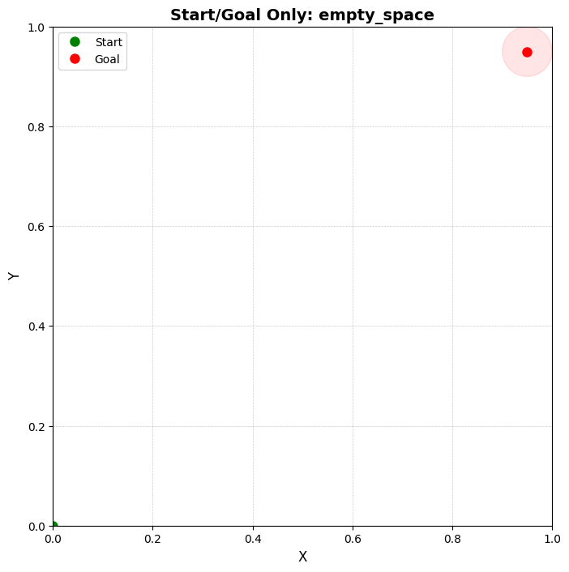
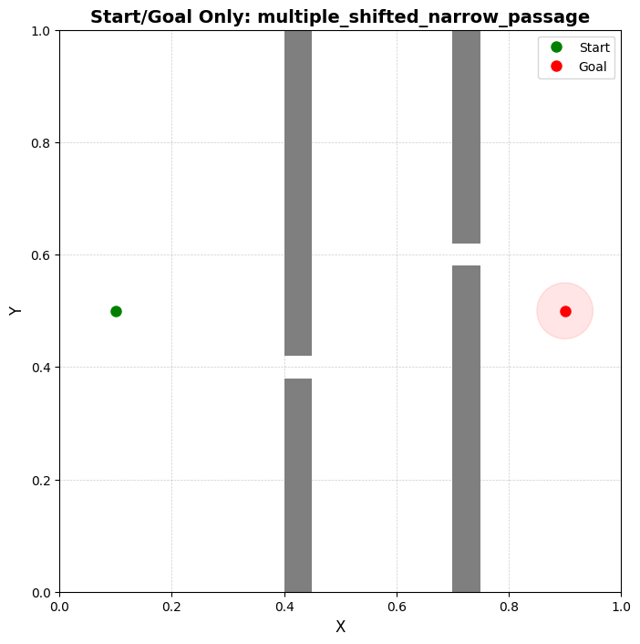
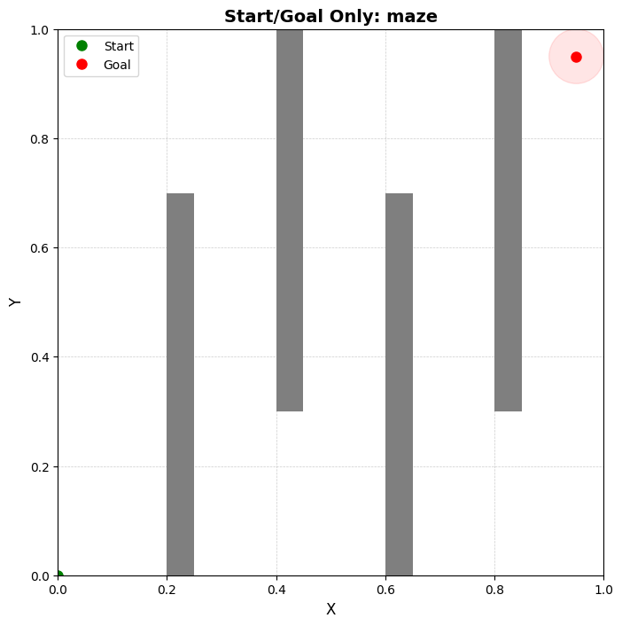
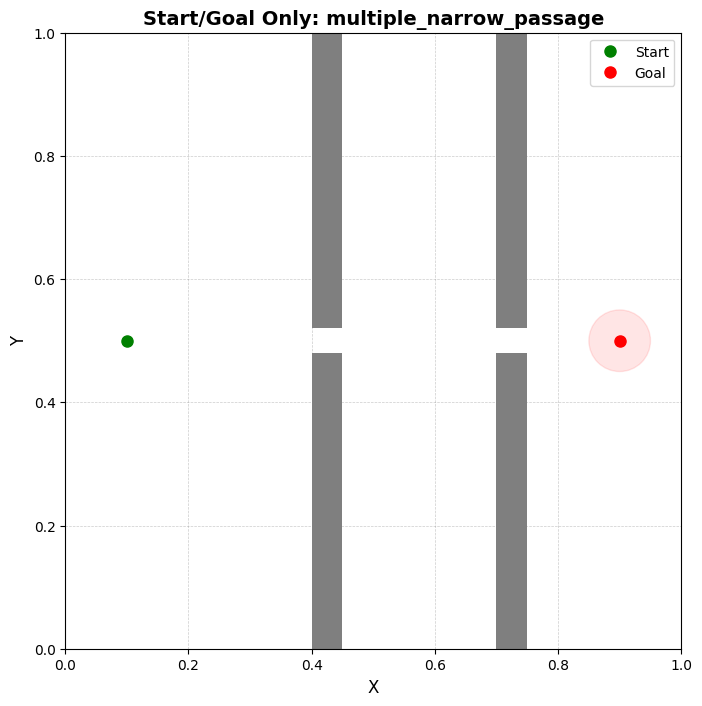
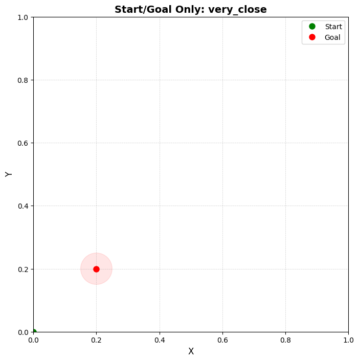
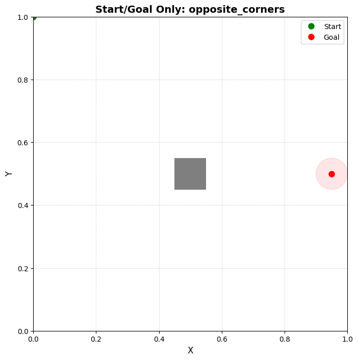
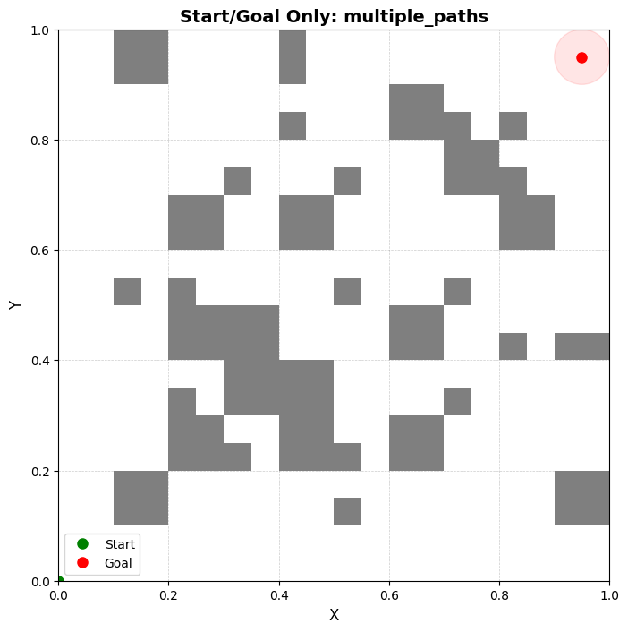
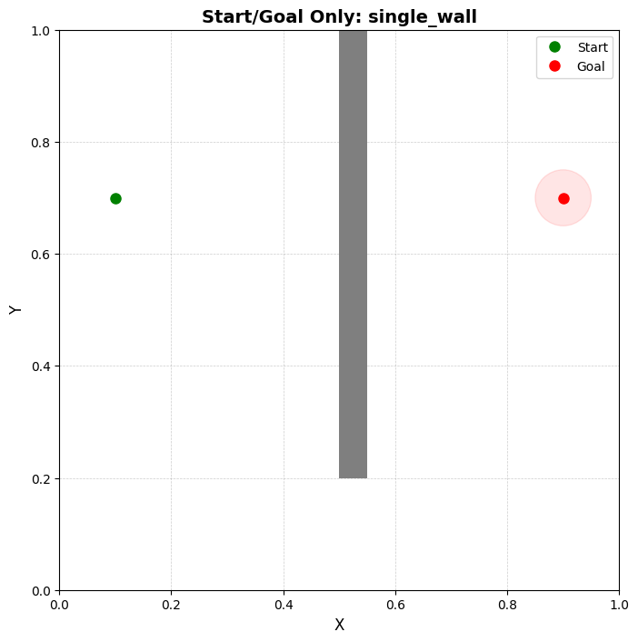
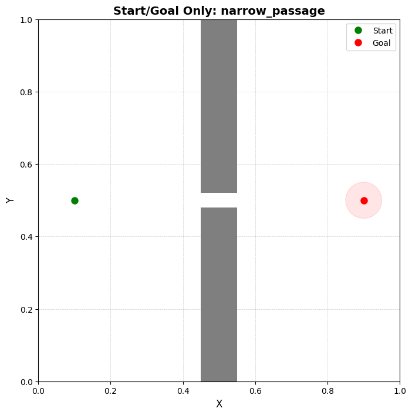
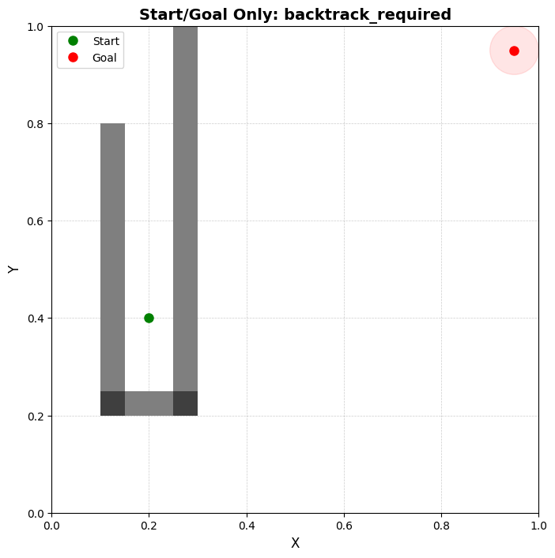

## Scenario Grid

- 2D scenarios config: [`scenarios.json`](../scenarios.json)
- 3D scenarios config: [`scenarios_3d.json`](../scenarios_3d.json)

Below are the available rendered scenario figures.

### 3D scenarios

- Default 3D (static)

- Center hole (static)

- Default 3D (rotating)

- Center hole (rotating)

### 2D scenarios

Static renders from `AnalysisV2/Graphics2d/Scenarios2d`:

For heuristic overlays, see the Heuristic Grid page:

- See: [Heuristic Grid](./heuristic-grid.md)
