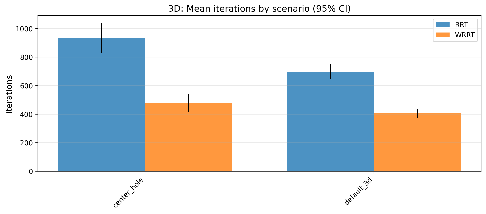
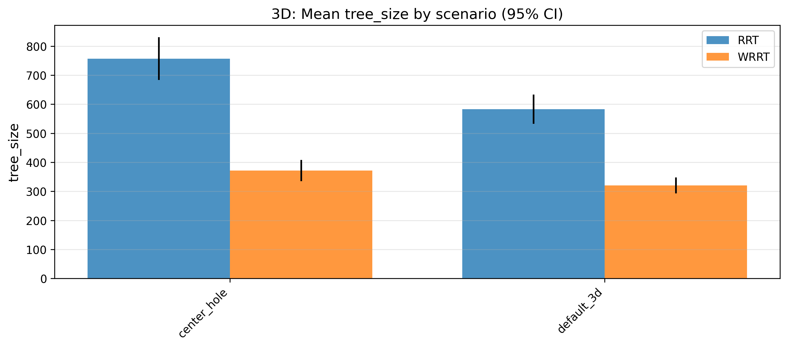
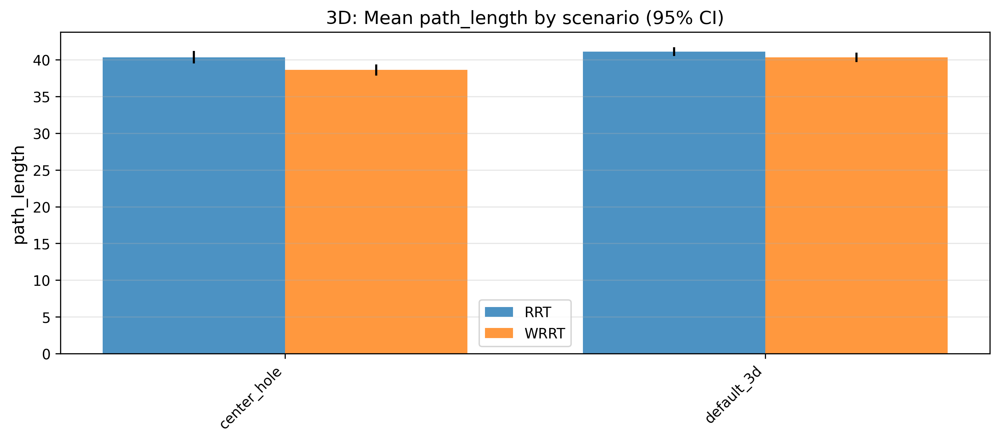
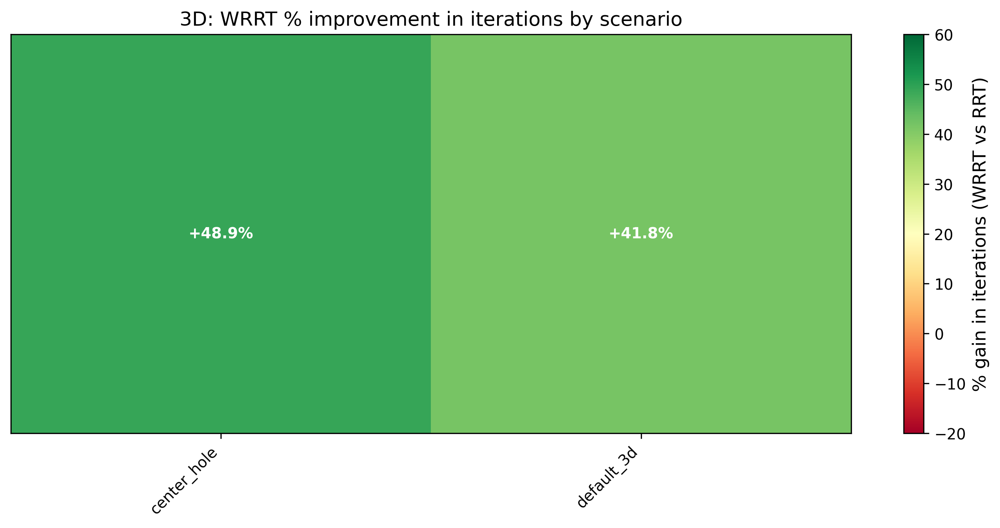
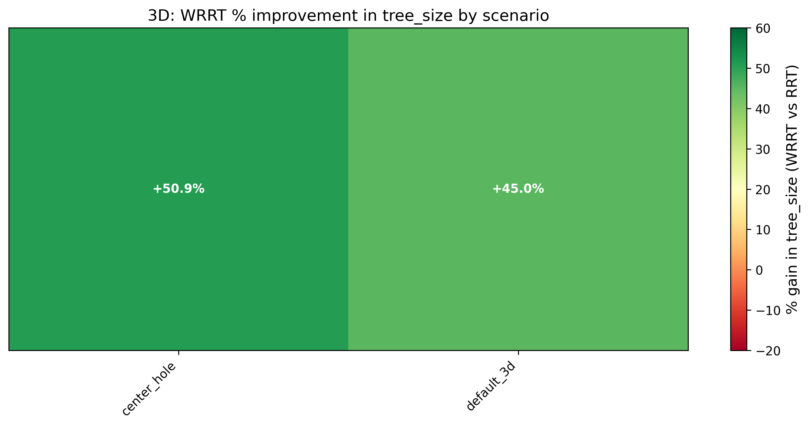
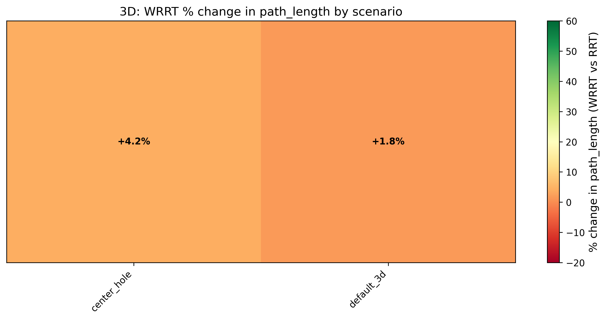

# RRT with Goal-Based Heuristics

### Scenario summaries

| Iterations (per-scenario) | Tree size (per-scenario) |
| :---: | :---: |
|  |  |
| Path length (per-scenario) | |
|  | |

### Improvement heatmaps

| Iterations improvement | Tree size improvement | Path length improvement |
| :---: | :---: | :---: |
|  |  |  |

### More 2D plots

Open extra 2D figures (boxplots, CDFs, scatter)

## 3D visualizations and results

### Default 3D scenario

| Scenario | RRT Path | WRRT Path |
| :---: | :---: | :---: |
|  |  |  |

### Center hole 3D scenario

| Scenario | RRT Path | WRRT Path |
| :---: | :---: | :---: |
|  |  |  |

### 3D summary figures
| Iterations (per-scenario) | Tree size (per-scenario) | Path length (per-scenario) |
| :---: | :---: | :---: |
|  |  |  |

| Iterations improvement | Tree size improvement | Path length improvement |
| :---: | :---: | :---: |
|  |  |  |

Open extra 3D figures (boxplots, CDFs, scatter)

## Heuristic maps and example paths

Open heuristic maps and paths

_(0.2,%200.2).png)
_(0.95,%200.95).png)
_(0.95,%200.5).png)
_(0.9,%200.5).png)
_(0.9,%200.7).png)
_(0.95,%200.95).png)

