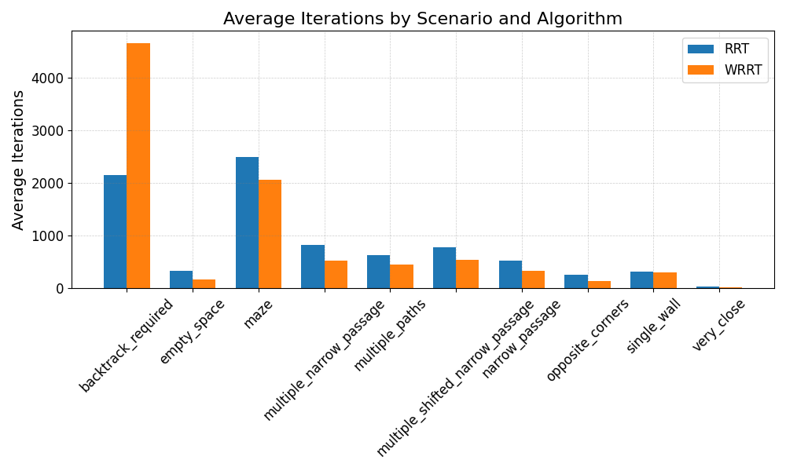
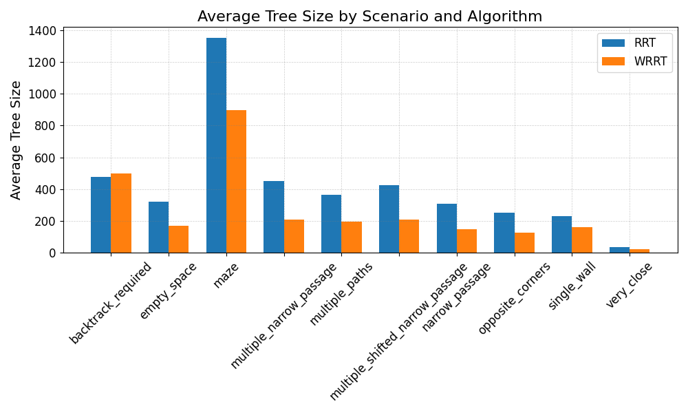
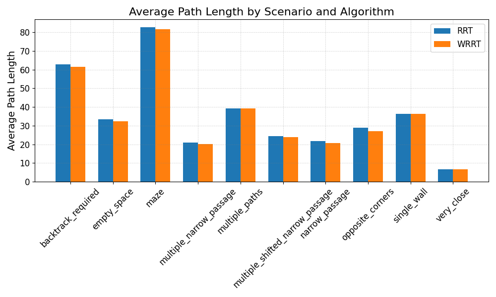
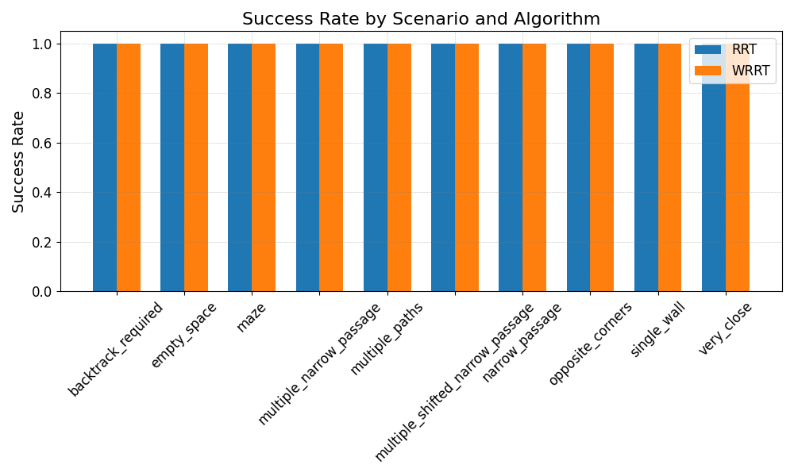
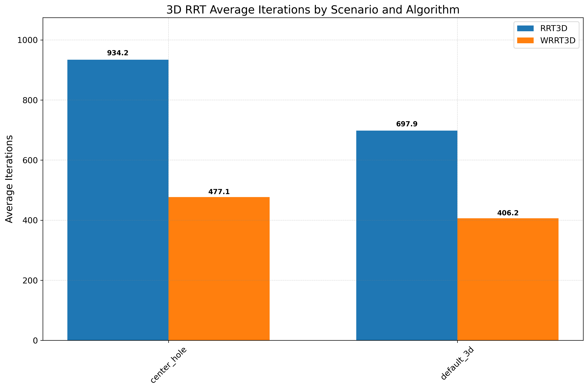
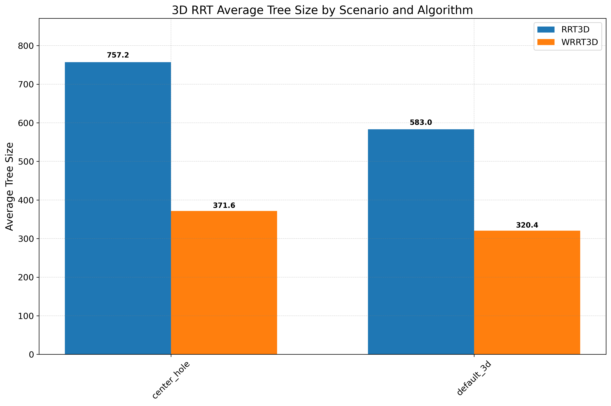
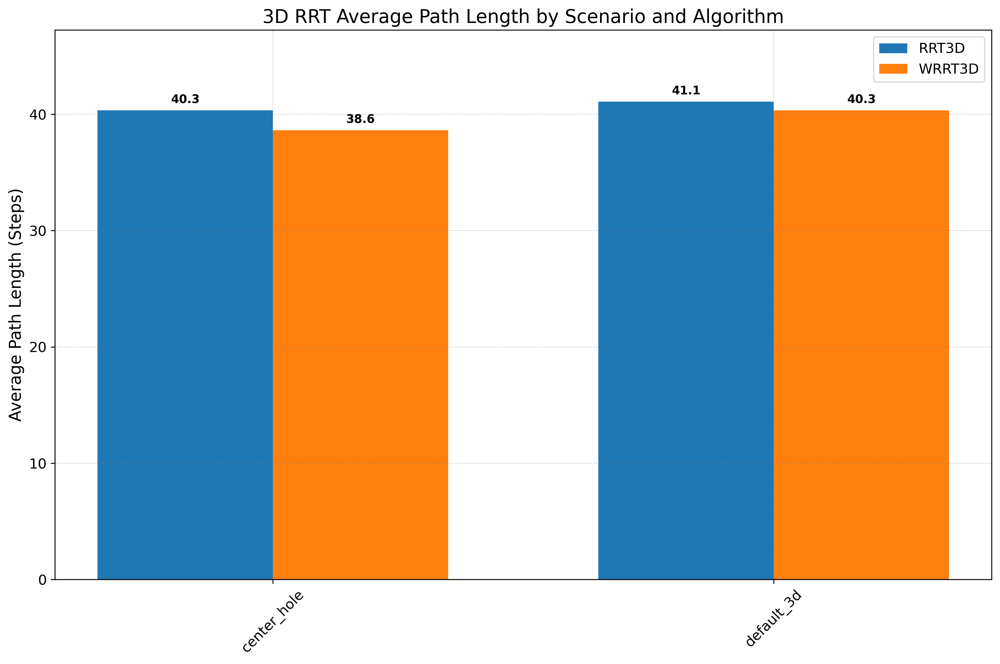
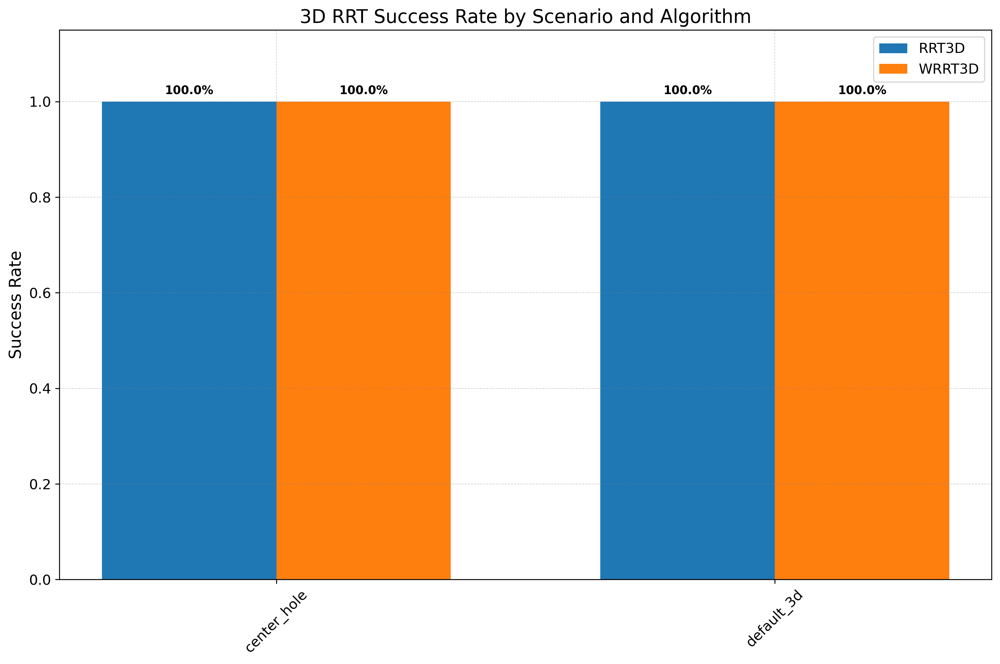

# RRT with Goal-Based Heuristics

This project investigates the impact of using a goal-based Euclidean distance heuristic to guide the sampling process of the Rapidly-Exploring Random Tree (RRT) algorithm. It compares the performance of a standard RRT with a weighted variant (WRRT) across various 2D and 3D scenarios.

### 2D Performance Metrics

| Average Iterations | Average Tree Size |
| :---: | :---: |
|  |  |
| **Average Path Length** | **Success Rate** |
|  |  |
## 3D Visualizations and Results

Below are the results and visualizations from the 3D experiments.

### 3D Performance Metrics

| Average Iterations | Average Tree Size |
| :---: | :---: |
|  |  |
| **Average Path Length** | **Success Rate** |
|  |  |

### Default 3D Scenario

| Scenario | RRT Path | WRRT Path |
| :---: | :---: | :---: |
|  |  |  |

### Center Hole 3D Scenario

| Scenario | RRT Path | WRRT Path |
| :---: | :---: | :---: |
|  |  |  |